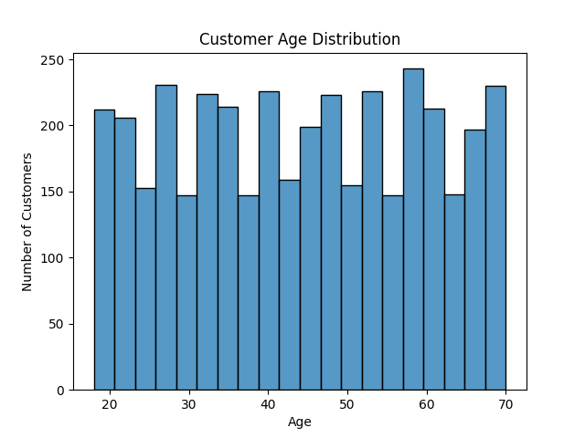
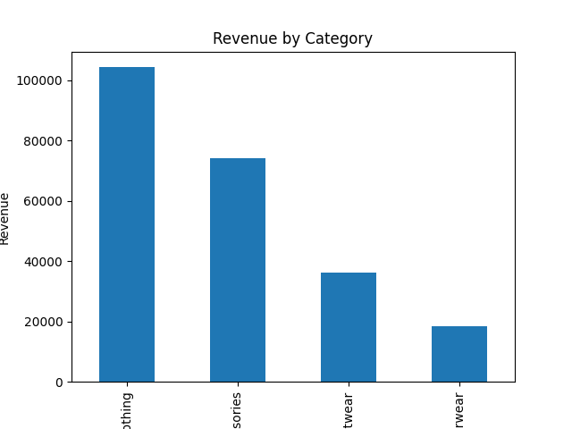
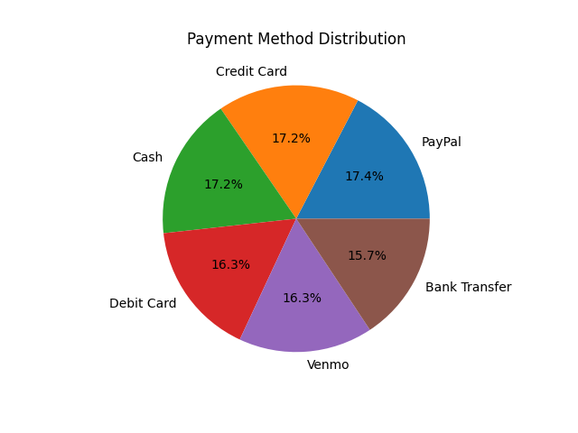
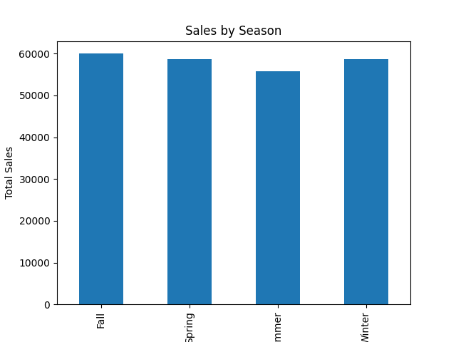
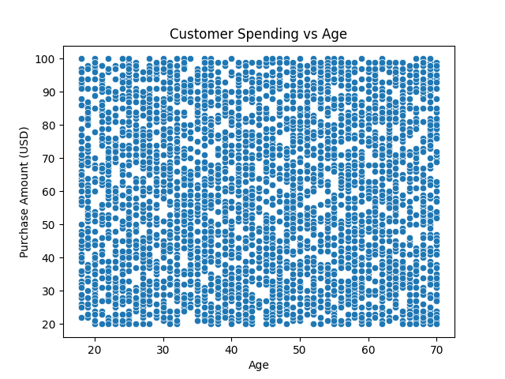

# Customer Shopping Behavior Analysis


---

## Project Overview

This project analyzes customer shopping behavior using **Python, SQL, and data analytics techniques** to uncover insights about purchasing patterns, demographics, and sales trends.

The objective is to identify key factors influencing customer spending and provide insights that could support data-driven business decisions.

The project demonstrates an **end-to-end data analytics workflow**, including data preprocessing, exploratory data analysis, customer segmentation, predictive modeling, and SQL-based business analysis.

---

## Dataset Description

The dataset contains customer shopping records including demographic information, product categories, and transaction details.

Key attributes include:

* Customer ID
* Age
* Gender
* Product Category
* Purchase Amount (USD)
* Season
* Payment Method
* Previous Purchases

---

## Tools & Technologies

* **Python**
* **Pandas**
* **NumPy**
* **Matplotlib**
* **Seaborn**
* **SQLite (SQL Queries)**
* **Jupyter Notebook**

---

## Project Workflow

1. **Data Loading**
2. **Dataset Exploration**
3. **Data Cleaning**
4. **Feature Engineering**
5. **Exploratory Data Analysis**
6. **Customer Segmentation**
7. **Predictive Modeling (Linear Regression)**
8. **SQL-Based Business Analysis**

---

## Key Insights

* Certain product categories generate significantly higher revenue.
* Customer demographics influence purchasing patterns.
* Seasonal trends affect overall sales performance.
* Payment method analysis reveals customer transaction preferences.
* Predictive modeling helps estimate potential customer spending.

---

## Visual Insights

### Customer Age Distribution


### Revenue by Product Category


### Payment Method Distribution


### Seasonal Sales Trends


### Customer Spending vs Age


---

## SQL Business Analysis

SQL queries were used to answer key business questions such as:

* Total revenue generated
* Revenue by product category
* Average spending by gender
* Seasonal sales trends
* Most frequently used payment methods

---

## Repository Structure

```
customer-shopping-behavior-analysis
│
├── Customer_Shopping_Behavior_Analysis.ipynb
├── customer_shopping_behavior.csv
├── business_queries.sql
└── README.md
```

---

## Future Improvements

Planned enhancements for this project:

* Build an **interactive Power BI dashboard**
* Perform **advanced customer segmentation**
* Apply **machine learning models for improved predictions**
* Add **interactive visualizations**

---

## Author

**Naved Ahmed Shaik**

Computer Science & AI Student
Interested in **Data Analytics, Machine Learning, and Data Visualization**
